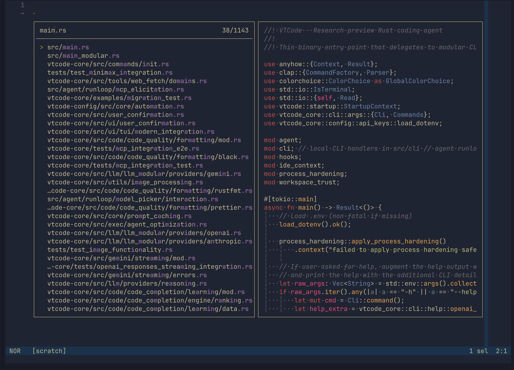
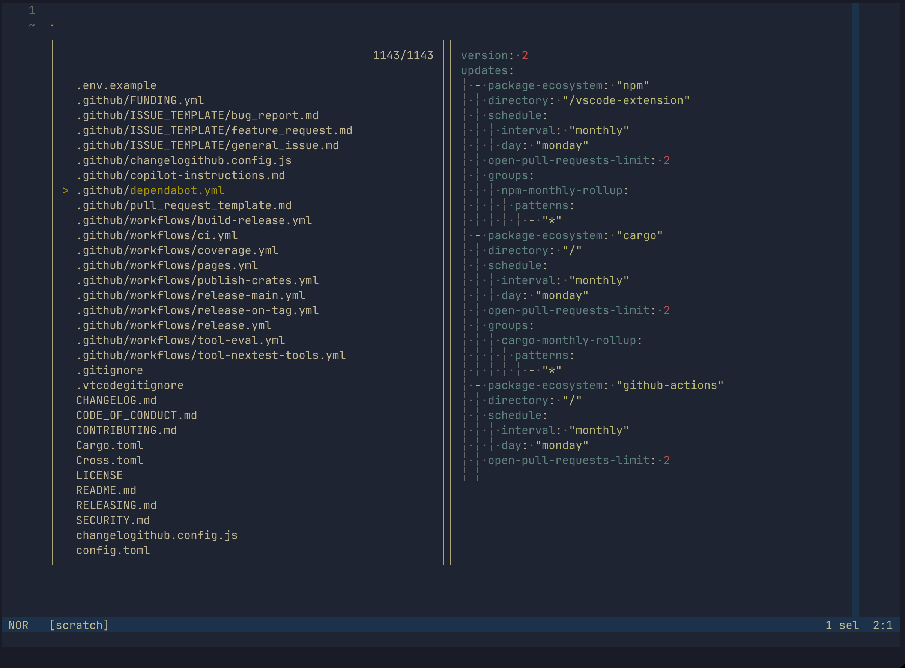
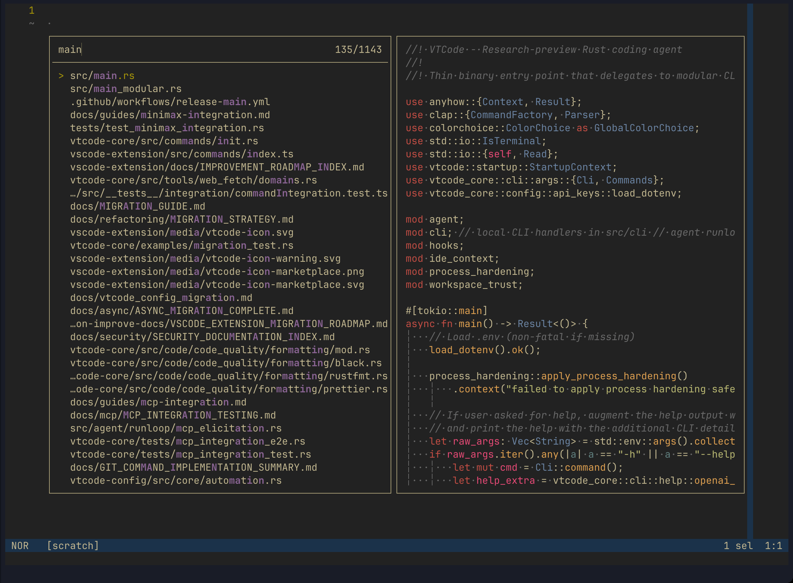
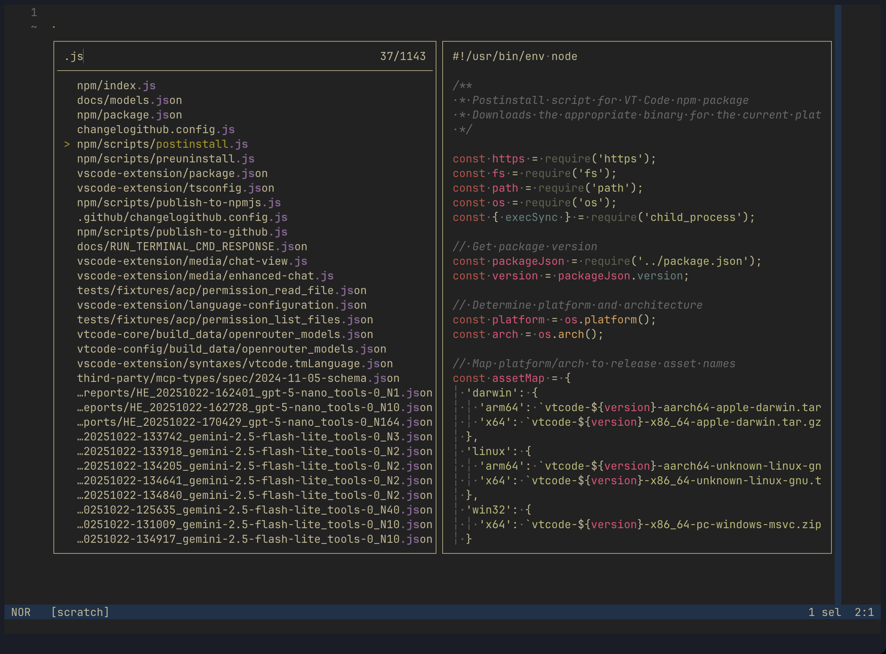
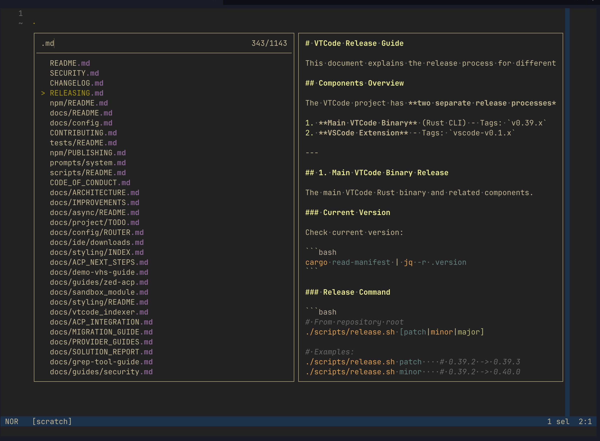

# Ciapre Helix Themes

A collection of themes for the Helix editor based on the Ciapre color scheme originally created as TextMate themes.

## Screenshots

### Ciapre (Blue Theme)
|                     Ciapre 1                      |                     Ciapre 2                      |                     Ciapre 3                      |
| :-----------------------------------------------: | :-----------------------------------------------: | :-----------------------------------------------: |
|  |  |  |

### CiapreBlack (Dark Theme)
|                     CiapreBlack 1                      |                     CiapreBlack 2                      |                     CiapreBlack 3                      |
| :---------------------------------------------------: | :---------------------------------------------------: | :---------------------------------------------------: |
|  |  |  |

## Themes Included

-   **Ciapre**: A dark theme with a blue background and warm accent colors
-   **CiapreBlack**: A darker variant with a black background and the same warm accent colors

## Installation

### Automatic Installation (Recommended)

Run the setup script to automatically install the themes and optionally configure your default theme:

```bash
./setup.sh
```

### Manual Installation

1. Locate your Helix configuration directory:

    - Linux/macOS: `~/.config/helix/`
    - Windows: `%AppData%\helix\`

2. Create a `themes` directory if it doesn't exist:

    ```bash
    mkdir -p ~/.config/helix/themes
    ```

3. Copy the `.toml` theme files to the themes directory:

    ```bash
    cp ciapre.toml ~/.config/helix/themes/
    cp ciapreblack.toml ~/.config/helix/themes/
    ```

4. Update your Helix configuration file (`config.toml` in the Helix config directory) to use one of the themes:

    ```toml
    [theme]
    default = "ciapre"
    ```

    Or to use the black variant:

    ```toml
    [theme]
    default = "ciapreblack"
    ```

### Configuration

You can also set the theme on a per-project basis by adding a `.helix` directory to your project and creating a `config.toml` file with your theme preference.

## About the Colors

The Ciapre themes feature:

-   Dark backgrounds for reduced eye strain
-   Warm accent colors for syntax highlighting
-   Carefully selected contrast ratios for readability
-   Support for a wide range of programming languages

## License

This project is licensed under the MIT License - see the [LICENSE](LICENSE) file for details.
